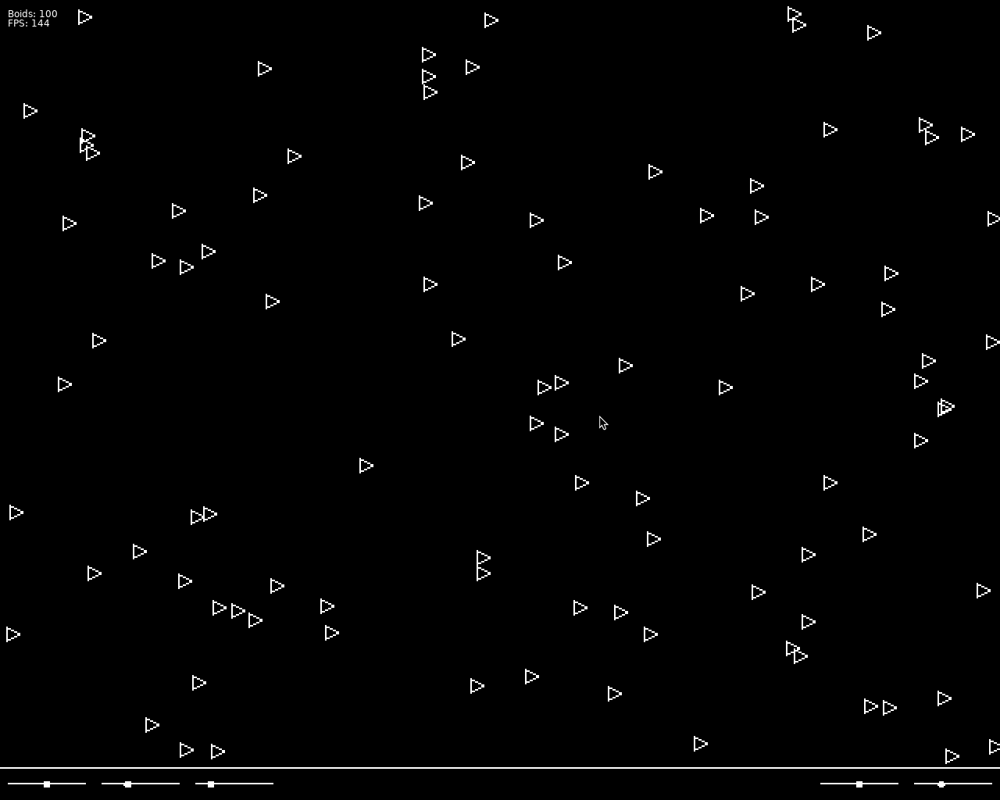

# 🛆 Boids - 🐦 Flocking simulation in Lua Love2D
Love2D implementation of the Boids simulation.
https://en.wikipedia.org/wiki/Boids

- <kbd>Space</kbd> Pause/Unpause
- <kbd>Right Click</kbd> Spawn Boids
- <kbd>A</kbd> Show/Hide viewing areas
- <kbd>T</kbd> Show/Hide trails
- <kbd>B</kbd> Enable/Disable turning on borders
- <kbd>M</kbd> Enable/Disable mouse follwing



## Build
The project requires [Love2D](https://love2d.org/).
Simply run:
```
love .
```
on the project's root.

## References
- Boids simulation: https://vanhunteradams.com/Pico/Animal_Movement/Boids-algorithm.html
- Boids simulation in p5: https://p5js.org/examples/simulate-flocking.html
- Steering behaviour: https://code.tutsplus.com/understanding-steering-behaviors-seek--gamedev-849t
- Love2D sliders: https://love2d.org/forums/viewtopic.php?t=80711
- Love2D Wiki: https://love2d.org/wiki/Main_Page